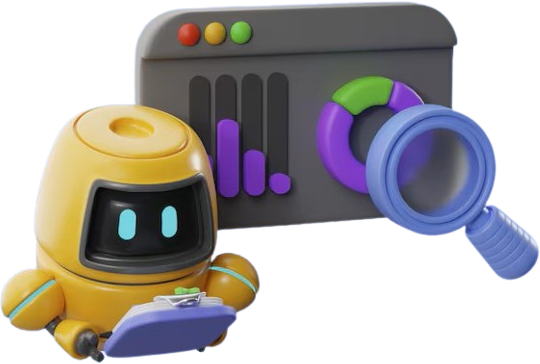

# Lumina RAG-App 🤖✨

<p align="center">
  
</p>

Lumina is a professional RAG (Retrieval-Augmented Generation) application built for intelligent document analysis and high-performance chatting. Now fully optimized with a **100% TypeScript** architecture for seamless Vercel deployment.

## 🛠️ Tech Stack

Lumina is built using modern, high-performance technologies across the entire stack:

- **Framework**: [Next.js](https://nextjs.org/) (React & TypeScript) - Unified frontend and backend.
- **Styling**: [Tailwind CSS](https://tailwindcss.com/) & [Framer Motion](https://www.framer.com/motion/).
- **3D Graphics**: [Three.js](https://threejs.org/) (for interactive 3D mascot).
- **AI Orchestration**: [LangChain.js](https://js.langchain.com/).
- **Vector Storage**: In-memory optimized storage for Serverless environments.
- **LLMs**: [Llama-3.3-70b](https://meta.ai/) (via [Groq](https://groq.com/)) and [Gemini](https://deepmind.google/technologies/gemini/) (for high-fidelity embeddings).

## 🏗️ System Architecture & Workflow

The application follows a streamlined RAG pipeline:

1.  **Document Intake**: PDFs are uploaded and processed directly via Next.js API Routes (`/api/upload`).
2.  **Vectorization**: Text is extracted using `pdf-parse` and vectorized using `Google Generative AI Embeddings`.
3.  **Indexing**: Document chunks are stored in an optimized memory vector store.
4.  **Retrieval**: Queries trigger a semantic search to find the most relevant document context.
5.  **Generation**: Context + Query are sent to **Groq (Llama-3.3)** for near-instant, precise responses.
6.  **Interactive Loop**: Features full message history, editing, and answer regeneration.

## 🚀 Quick Start (Local Setup)

### 1. Install Dependencies
```bash
npm install
```

### 2. Configure Environment Variables
Create a `.env` file in the root directory:
```env
GOOGLE_API_KEY=your_key_here
GROQ_API_KEY=your_key_here
```

### 3. Run the App
```bash
npm run dev
```

## 🔑 Required API Keys

1.  **Google API Key**: Get it at [Google AI Studio](https://aistudio.google.com/app/apikey)
2.  **Groq API Key**: Get it at [Groq Cloud Console](https://console.groq.com/keys)

## Production / Log warnings

- **Prisma**: In production you may see: *"we recommend using \`prisma generate --no-engine\`"*. That option is for Prisma 6.16+ with the client engine and a driver adapter; the app works without it. To adopt it later, upgrade to Prisma 6.16+, set `engineType = "client"` in `schema.prisma`, and use `@prisma/adapter-pg` (see [Prisma no-rust-engine docs](https://www.prisma.io/docs/orm/prisma-client/setup-and-configuration/no-rust-engine)).
- **Node \`url.parse\` deprecation**: This comes from a dependency (e.g. LangChain). The Vercel config sets `NODE_OPTIONS=--no-deprecation` so this warning is hidden in production. Locally you can run `NODE_OPTIONS=--no-deprecation npm run dev` to hide it.

## ✨ Key Features
- **Pure TypeScript**: No Python required, ensuring 100% deployment stability on Vercel.
- **Ultra-Fast Responses**: Powered by Groq's high-performance inference engine.
- **Glassmorphic UI**: Premium design with interactive 3D elements.
- **Streaming Support**: Real-time AI responses for a smooth user experience.
- **Vercel Optimized**: Deploy in one click without complex multi-service configuration.
